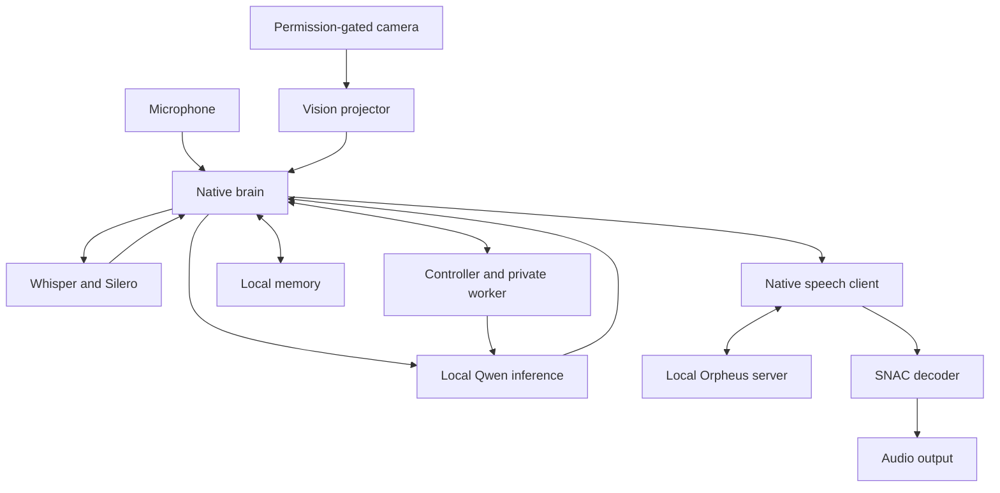

# Athena R26.1 - AI Bill of Materials

**Document revision 3 | Updated 19 September 2026 | Projector installer reconciled; licensing package 2.0 retained | Partial, source-grounded reference AIBOM**

This AIBOM describes Athena R26.1 as a local, native voice-and-vision system assembled from stock Athena and its consciousness overlay. It records software, models, prompts, data categories, conditional actions, trust boundaries and supporting evidence. It covers the documented reference configuration, including private reflection, dreaming, memory, sustained initiative, camera recall and coordinated speech. It does **not** attest to the contents or behavior of a particular installed machine. [E01] [E07] [E08]

The canonical inventory is [athena-r26.1.cdx.json](aibom/athena-r26.1.cdx.json). Its [graph companion](aibom/athena-r26.1.graph.json) records directed flows and conditional behavior. Together they contain **79 components, four services and 52 directed flows**. The [source manifest](aibom/source-files.json) hashes all **121 tracked files** in the two project snapshots: 87 overlay files and 34 stock files. The [evidence index](aibom/evidence.json) contains **80 evidence records**, including the supplied licensing package 2.0. See the [revision record](aibom/CHANGES.md).

**Projector update:** the overlay now acquires and verifies the pinned default vision projector during a full install, with projector-only and explicit skip modes. Only `README.md` and `patches/install-consciousness.sh` changed from the prior reviewed overlay: the other 85 overlay files, including native runtime code, are byte-identical. Stock source is unchanged. The [source-update record](aibom/source-update.json) preserves the exact delta and bounded checks. This adds installation flows, not cloud inference or new camera authority. [E24] [E86] [E87]

**Licensing basis retained:** both projects have supplied v2.0 license documents in the evidence set. Their declared terms are recorded for licensor-controlled Covered Material, separately from historical and third-party rights. The current overlay has advanced beyond those documents' earlier review commit; the supplied documents themselves are unchanged. Actual repository adoption commits and deployment acceptance/compliance have not been established. Unmodified supporting documents are retained under [licensing/snapshot](aibom/licensing/README.md). [E60]-[E68]

## 1. Identity, authorship and scope

| Field | Declaration |
| --- | --- |
| System | Athena with Consciousness R26.1 |
| Graph type | Reference runtime system, with separately labeled build and upstream-lineage context |
| Overlay source | [`igorbarshteyn/athena-consciousness`, `b3c6e54ead4976c043cd0fca9452bd07d7e2689c`](https://github.com/igorbarshteyn/athena-consciousness/tree/b3c6e54ead4976c043cd0fca9452bd07d7e2689c) |
| Tested stock source | [`igorbarshteyn/athena`, `e747c0362c4e1c3b95756a57154d09b8df7811ce`](https://github.com/igorbarshteyn/athena/tree/e747c0362c4e1c3b95756a57154d09b8df7811ce) |
| Release-label basis | Overlay README says R26.1; the changelog starts with r26. The exact commit is authoritative. No Git tag is invented. |
| Project maintainer / first-party author | Igor Barshteyn, for his Athena-specific original contributions. Upstream models, libraries and derived code retain their own authorship. |
| AIBOM preparer | OpenAI Codex, using AI-assisted source review at Igor Barshteyn's request |
| Human review / approval / signature | Not recorded; no approval or signature is asserted on Igor's behalf |
| Completeness | **Partial.** Source identities and declared interfaces are grounded; installed artifacts, transitive closure and supplier training lineage remain incomplete. |
| Licensing basis | Supplied Athena Noncommercial, Attribution and Responsible Deployment License 2.0, `LicenseRef-Athena-NCARD-2.0`; project-specific scope and earlier rights remain controlling |
| License adoption / assent | Actual adoption commits and executed acceptance records not supplied; the pre-adoption source commits are not adoption identifiers |
| Validity | Runtime inventory: identified commits and reference configuration. Licensing: separately fingerprinted v2.0 documents. Reassess on any material change. |

Included: the overlay and tested base, native processing modules, seven runtime model roles, declared first-level software dependencies, build-only installation/conversion tools, prompts/configuration, mutable data categories, local interfaces and conditional authority. Excluded: private user data, actual installed weights/binaries, exhaustive operating-system and package dependencies, upstream training infrastructure, unconfigured alternative models, and claims of subjective consciousness, safety certification or regulatory compliance.

Three evidence views remain separate: **declared** describes source/configuration and publisher statements; **reachable** describes statically identified actions subject to configuration and native gates; **observed** requires execution evidence. This package has no target-machine runtime observations and makes no exhaustive reachability claim. Missing inventory entries therefore do not establish that an installation lacks those dependencies.

## 2. How the supplied guidance is applied

The supplied **OWASP AIBOM Foundations Guide v1.0** was reviewed across all 41 PDF pages. Its printed pages 16-21 supply the inventory/scope/flow/evidence structure; pages 28-31 address agentic authority and dynamic dependencies; pages 32-37 address ownership and updates. The exact PDF's SHA-256 is recorded under `E42` in the evidence index. The PDF itself is not redistributed.

An important publication distinction: printed pages 26-27 discuss CycloneDX **2.0** blueprints as the encoding. The official specification page currently identifies **1.7**, while the August 2026 announcement describes 2.0 as forthcoming. This package consequently uses released, schema-validated **CycloneDX 1.7** for inventory, model cards, services, dependencies and completeness. The companion graph has an explicitly labeled Athena schema; it is **not** presented as a CycloneDX 2.0 blueprint or an official OWASP extension. Stable references allow a later migration. [E29] [E30] [E31]

| Guidance element | Implementation |
| --- | --- |
| Accountable header, generation method, scope, completeness | This section; CycloneDX metadata/properties and incomplete composition; graph header |
| Component and service identity | Stable `bom-ref` identifiers, source commits, component evidence and applicable publisher identities |
| Model/data provenance and rights | Model cards, ancestor references, training-disclosure records, licensing discrepancies and artifact manifest |
| Directed data and control movement | 52 individually identified graph edges; requests and responses are separate |
| Trust context and conditional behavior | Logical zones, boundary references, six existing behavior records plus one build/install behavior, and tool-permission descriptions |
| Evidence and integrity | Source SHA-256, publisher-card snapshots, registry-reported artifact digests, validation report and package checksums |
| Controlled lifecycle | Update triggers and review procedure below; no claim that CI enforcement is already installed |

CycloneDX `dependencies` records dependency relationships, not data movement. Upstream training ancestors are separately labeled and excluded from the runtime dependency scope. Model-hub services are installation suppliers, not cloud inference services in the reference topology.

## 3. Reference architecture and operating profile

The native brain runs Whisper STT, local Qwen inference, a native consciousness controller and source-aware memory. The private worker uses a separate inference context with the same Qwen weights and serialized decode access. The speech application sends text to a separate local `llama-server` serving Orpheus, decodes its audio tokens with SNAC, and plays PCM audio. Thus, there are **two distinct llama.cpp code lineages**: the copy inside pinned Whisper for the brain, and an independently acquired checkout for the TTS server. [E04] [E07] [E09] [E12]



This overview omits build-time and detailed receipt paths; the graph JSON is authoritative for individual directions, payloads and conditions.

| Setting | Reference declaration; not an installed observation |
| --- | --- |
| R26 additions | Opt in with `ATHENA_R26=1`. An explicit master `0` dominates individual settings; without a master-on value, an individual nonzero feature setting can enable its own group. Eight groups cover access, meta, memory, dialogue, affect, private continuity, timing and speech. [E14] |
| Older capabilities | Master-off restores earlier behavior paths; it does not disable every previously existing Athena capability. [E14] [E22] |
| Initiative | `sustained` is the native default; `legacy` and `shadow` are alternatives. [E15] |
| Dream threshold | Native default 1,800 seconds; the README's sample profile sets `ATHENA_DREAM_AFTER_S=420`. These are different configurations. [E01] [E08] |
| Main inference | Supplied launcher: context 80,000; CPU MoE; GPU offload; BF16 K/V; temperature 0.70, top-p 0.80, top-k 20, min-p 0; reasoning off. [E03] |
| Vision | Local `models/mmproj-BF16.gguf`; `/dev/video0`; requested 1920x1080 capture; work edge 800; acuity edge 1920; `--look-max 15`, `--recall-max 6`. Actual camera mode can differ. [E03] [E11] |
| Speech | Loopback `127.0.0.1:8080`; native `/completion` API, HTTP/SSE; default voice `tara`; SNAC 24 kHz output; `aplay -q`. [E03] [E12] |
| Memory | Existing `athena_memory` directory; launcher requests `--memory-words 2048`. No memory contents are bundled. [E03] |
| Launcher selection | Overlay preserves the operator's root launcher unless installed with `--launcher`. These reference settings cannot be assumed active after an ordinary overlay install. [E01] [E24] |
| Local/cloud boundary | Reviewed default conversation path is local. Build downloads use external suppliers; `--api` can redirect the speech client and must be inventoried if changed. No hosted conversational LLM, MCP server or A2A interface is declared in this reference. [E02] [E07] [E12] |

## 4. AI models, transformations and training visibility

The [model artifact manifest](aibom/model-artifacts.json) records individual filenames, repository snapshots, sizes and upstream registry SHA-256 values for ten downloadable files, plus the local emotion2vec export entry. Five of the downloadable files constitute the main Qwen model. **Registry-reported hashes are reference evidence, not verified installed-file hashes.** No model weights were downloaded or executed during this preparation.

| ID / role | Declared artifact and origin | Lineage / rights / limitation |
| --- | --- | --- |
| `M-qwen`: conversation, reflection, dreams and memory transformations | Unsloth `Qwen3.5-397B-A17B-UD-Q3_K_XL`, five GGUF shards | Derived from Qwen's post-trained 397B-total/17B-active multimodal model; publisher labels Apache-2.0. Quantization/calibration pipeline and installed revision are not attested. [E50] [E51] |
| `M-projector`: vision encoding | Unsloth `Qwen3.5-397B-A17B-GGUF`, `mmproj-BF16.gguf`, exact revision below | The overlay installer now acquires/verifies this size-and-hash-pinned reference by default; stock installer still does not. Publisher declares Apache-2.0. Local bytes, active model/projector pairing and live vision are unobserved. [E02] [E03] [E24] [E51] [E87] |
| `M-whisper`: English speech recognition | `ggerganov/whisper.cpp`, `ggml-small.en.bin` | Conversion of Whisper small.en; selected distribution declares MIT. Original GitHub MIT and HF Transformers Apache-2.0 labels are retained as distinct declarations. [E54] [E55] [E37] [E38] |
| `M-silero`: voice activity detection | `ggml-org/whisper-vad`, `ggml-silero-v6.2.0.bin` | Silero VAD conversion, MIT declaration. Exact original checkpoint-to-conversion run is not supplied. [E56] [E39] |
| `M-orpheus`: text to audio tokens | Unsloth `orpheus-3b-0.1-ft-UD-Q4_K_XL.gguf` | Cards name Canopy fine-tuned/pretrained and Meta Llama 3.2 3B Instruct ancestors. Apache-2.0 card labels are not Apache-only weight clearance. The supplied v2.0 review reports a maintainer code/weight distinction; exact checkpoint terms, Llama notices/AUP and applicable attribution still need reconciliation. [E52] [E53] [E36] [E69] [E70] |
| `M-snac`: tokens to PCM | `onnx-community/snac_24khz-ONNX`, `onnx/decoder_model_fp16.onnx`, renamed locally to `orpheus/snac24_dynamic_fp16.onnx` | Derived from `hubertsiuzdak/snac_24khz`; MIT labels. ONNX conversion recipe/run and installed digest are unavailable. Generated `.optimized` cache is a further local artifact. [E57] [E58] [E12] |
| `M-emotion`: optional speech-emotion scores | Local `emotion2vec_plus_large.onnx`, exported using stock Python recipe | Nine scores, 16 kHz waveform, dynamic axis, ONNX opset 17. FunASR maps `iic/emotion2vec_plus_large` to official `emotion2vec/emotion2vec_plus_large`. Installed FunASR/checkpoint/export identity remains unknown. Custom model terms, not an assumed permissive code license. [E06] [E20] [E33] [E34] [E35] [E59] |

The first-party runtime uses these weights for inference. No default Athena weight-training pipeline or active LoRA adapter is declared in the inspected configuration. Memory changes, preferences, project progress and dream retention are changes to runtime state and stored context; they do not demonstrate weight updates. Tokenizers and model configuration embedded in GGUF/GGML artifacts inherit those artifacts' identification gaps. Swapping to another model or an altered/abliterated variant requires a new model record and evaluation scope, even if the filename is similar.

Upstream data is represented by six explicitly incomplete disclosure records (`T-qwen`, `T-whisper`, `T-silero`, `T-orpheus`, `T-snac`, `T-emotion`). They are not invented dataset snapshots. The reviewed sources describe broad training approaches, internet speech, speech-codec training or pseudo-labeled emotion data, but do not supply complete item-level inventories, rights, hashes, split/contamination analysis or reproducible training runs. The emotion card's seed/large-data progression is supplier evidence; it is not independent verification of the trained checkpoint. [E37] [E39] [E50] [E52] [E58] [E59]

The exporter compares seeded synthetic audio of 2-6 seconds against FunASR with a numeric tolerance. That checks the stated conversion procedure; it is neither a speech-emotion accuracy benchmark nor evidence that this user's ONNX file passed. [E06]

### Projector installation and integrity

The reviewed installer pins the following reference, independently matched to the publisher's raw artifact pointer. The SHA-256 in the BOM identifies this expected downloadable artifact; it is **not an observed installed-file hash**. [E24] [E87]

| Field | Pinned reference |
| --- | --- |
| Publisher repository | `unsloth/Qwen3.5-397B-A17B-GGUF` |
| Publisher revision | `da33c16fa4440f831149fcf53b98a22bc07785e5` |
| Publisher filename / installed reference path | `mmproj-BF16.gguf` / `models/mmproj-BF16.gguf` |
| Exact size | 921,705,184 bytes (approximately 922 MB decimal) |
| Expected SHA-256 | `b3624272d7b9b49ffe6c6d0c592980bed6b026ce59cde11708bb230395c2a227` |

| Installer mode | Projector behavior |
| --- | --- |
| Normal full install | Verify/reuse a matching file, or download/resume and verify the missing default before source/build mutations |
| `--vision-model-only` | Acquire/verify only; no source copy, rebuild or launcher replacement. Requires an existing stock checkout's structural preflight, but bypasses the full Whisper/ORT/build preflight. |
| `--skip-vision-model` | Explicitly skip default acquisition/checks for offline, custom-model or deliberately non-vision setups |
| `--check` | Verify size/hash without downloading, unless explicitly skipped |
| `--check-sources` or `--skip-build` | Source-only; neither download nor verify the projector |
| `--dry-run` | No downloads or writes; previews acquisition and can verify a file already present |

`--vision-model-only` cannot be combined with `--skip-vision-model`, `--skip-build` or `--launcher`; it can be previewed with `--dry-run`. A mismatched existing projector is refused and left untouched. Downloads use CLI curl with HTTPS-only redirects and a hash-specific resumable partial (`mmproj-BF16.gguf.b3624272d7b9.part`). Size and SHA-256 must match before same-filesystem, atomic no-clobber hard-link publication. The implementation rejects symlink model paths and hard-linked/oversized partials; failed or corrupt partials are retained for operator recovery. These are source-inspected controls, not a claim of independently tested race-proof behavior. [E24]

Model/partial files are outside the source rollback set: a verified model remains after source rollback. Acquisition does not activate the camera, grant capture/retention permission, or change a retained root launcher. The operator must verify the active `--mmproj` setting and model pairing; `--launcher` remains an explicit full-install choice. Download integrity establishes the reference bytes, not model safety, publisher authenticity beyond the reviewed evidence, or live vision quality. [E01] [E03] [E24]

## 5. Software, build and source provenance

| Material | Identity and scope |
| --- | --- |
| First-party native modules | Brain; controller; private worker; memory/continuity; projects/people; vision/album; R26 helpers; speech/prosody/protocol; optional calibrator and supervisor. Source paths and hashes identify the exact implementation. [E07]-[E21] |
| Whisper | Exact upstream pin `afa2ea544fb4b0448916b4a31ecd33c8685bd482`, checked on full/source operations unless drift is explicitly allowed; projector-only mode does not check this pin. This establishes a source baseline, not the provenance of an arbitrary binary. [E02] [E24] |
| Brain's llama.cpp / ggml | Vendored in pinned Whisper, with Athena source replacements. CMake declares llama origin `3e037f31`; 55 of 56 compared root C++/header files match the resolved origin, while `unicode.cpp` differs. No whole-tree equivalence is claimed. [E04] |
| Bundled libmtmd / CLIP | Declared origin resolves to `3e037f313c2c4cfce897d9be8f43954283a61de1`. Forty-two of 45 bundled files match; `mtmd-helper.cpp` and two vendor headers differ. Exact bundled hashes are authoritative. [E04] |
| Vendor headers | `stb_image` 2.30, MIT OR Unlicense; bundled `miniaudio` 0.11.25, MIT-0 OR Unlicense. The mtmd audio-file implementation is disabled by the build; inclusion of a header does not mean an audio feature is active. [E25] [E26] [E04] |
| TTS llama-server | Separate unpinned checkout obtained by stock install; actual revision/binary hash must be collected locally. It is not pinned by the brain's Whisper commit. [E02] |
| Native ONNX Runtime | Installer selects 1.27.0 CUDA-12 GPU distribution; `--ort` permits a different existing installation. Actual linked objects and CPU/GPU fallback path are unobserved. [E02] [E24] [E12] |
| Host/runtime dependencies | SDL2; libcurl; libc/C++/threads and other transitive libraries; ALSA/aplay; FFmpeg and fallback fswebcam; Bash/GNU/Linux utilities. Exact installed versions/license closure are unknown. [E01]-[E05] [E11] [E12] |
| Documented GPU/OS reference | Ubuntu 24.04.4 LTS, CUDA compiler 12.9.86, cuDNN 9.23.2.1 and NVIDIA driver 595.71.05. These are repository reference claims, not this AIBOM's host measurements or current-version recommendations. [E02] [E23] |
| Build tools | CMake, C++17 compiler/linker/native build tools and CUDA compiler. No installed compiler or build attestation is supplied. [E02] [E04] [E05] |
| Overlay installer (`C-install`) | Operator-run Bash acquisition/build component, separately inventoried at the new source commit. Not an autonomous runtime network tool. [E24] [E86] |
| CLI downloader (`S-curl-cli`) | Conditional install-time curl executable; distinct from speech's runtime libcurl (`S-curl`). Required only when a projector download/resume is needed. Installed version, TLS backend and package-license closure remain unknown. [E24] |
| Optional export environment | Python, FunASR, PyTorch, TorchAudio, ModelScope, ONNX, Python ONNX Runtime, NumPy and huggingface_hub. Installer requirements float; Python is build/conversion tooling, not the native conversational runtime. [E02] [E06] [E34] |

The source manifest records both file SHA-256 and Git blob OIDs/modes, without treating Git object IDs as file SHA-256. Native component source hashes do not stand in for executable hashes. Build duration, resolved compilation environment, final binaries and full native/Python SBOM closure are unobserved. The numerous model-family adapters under `mtmd/models/` are software support code; this AIBOM does not infer that Gemma, Llama, DeepSeek or other supported model weights are loaded.

## 6. Prompts, agents, tools and authority

`P-prompts` covers compiled conversation, private-inference, dream, memory-extraction, personality and report templates. `P-config` covers launch settings and feature gates. `P-wire` identifies the native speech protocol. Their evidence points to source files whose complete hashes appear in the manifest. Runtime personality/memory, model-embedded templates and operator edits must also be captured for a particular deployment. No external moderation or policy service is declared. Native source/consent/content gates are documented as implemented mechanisms; their presence does not establish comprehensive prompt-injection or harmful-content protection. [E07] [E08] [E10] [E13] [E14]

| Actor/tool | Invocation and authority | Constraints and evidence |
| --- | --- | --- |
| Native controller / initiative scheduler | In-process events/ticks; proposes speech, private work, projects and camera/recall actions | Native gates and human-first arbitration; a proposal does not grant camera permission. No independent model identity. [E08] [E15] |
| Private reflection/dream worker | Controller posts bounded work; same Qwen weights, separate context | Shared decode serialization, cancellation/epoch ownership and product acceptance; no independent shell or external API authority. [E07] [E09] |
| Memory and continuity | Native file reads, append/update/recovery, with LLM-assisted transformations | OS user filesystem access plus application source/ownership checks; local retrieval, without a declared embedding server/vector database. [E10] [E17] |
| Camera / recall / keep | Native dispatch invokes fixed capture programs and image processing | Separate capture/retention authority, revocation and budgets; default 20-second capture deadline. Tool definition is the versioned native implementation, not a discovered MCP schema. [E11] [E18] |
| Speech | Native file IPC to C++ daemon, then HTTP/SSE and audio subprocess | Session ownership, stop and delivery receipts; partial/unknown delivery remain distinguishable. `--api` and `--play` are operator configuration. [E12] [E13] |
| Optional launcher | Operator-run process and host supervisor | Can invoke sudo-dependent GPU/system tuning and diagnostics. These privileges are separate from model-selected actions. [E03] |

The reviewed runtime has no declared multi-provider agent federation, external connector catalog, MCP capability discovery or A2A Agent Cards. Its cooperating controllers/workers are recorded without inventing an agent framework or independent trained model for each module. Behavioral limits can be changed by feature flags and configuration; actual startup settings are required to establish the active policy.

## 7. Data movement, trust boundaries and privacy

| Flow IDs | Directed movement and payload |
| --- | --- |
| F01-F07 | Acoustic input enters native processing; VAD, ASR and optional emotion inference receive audio and return separate outputs. |
| F08-F16 | Memory reads/writes, prompt assembly, Qwen request/result and controller events/field updates. |
| F17-F22 | Private worker requests/results and persistent dream/project continuity. |
| F23-F28 | Permission-aware vision requests, camera frames, projector embeddings and separate album write/recall paths. |
| F29-F37 | Speech text/control IPC, loopback completion request and streamed result, SNAC decoding, audio output and return receipts. |
| F38-F40 | Diagnostics and operator-authorized host/GPU supervision. |
| F41-F48 | Installation/package requests and responses plus optional checkpoint-to-ONNX transformation. These are build flows. |
| F49 | Optional native calibration observations. |
| F50-F52 | Pinned projector HTTPS request, download response/partial, and verified local publication/reuse. These are build/install flows, not inference-time network traffic. |

The graph identifies eight **logical** zones: physical surroundings, native brain, local speech processes, local storage/IPC, host runtimes, privileged launcher administration, local build environment and external supply sources. Logical grouping is not sandbox isolation: brain modules share a process, and speech processes/storage commonly share an OS account.

The default speech API is plain HTTP on loopback, with no API authentication configured by the supplied launcher. It should not be described as an encrypted/authenticated cloud service. Local IPC also does not provide a separately authenticated user boundary. Redirecting `--api`, rebinding the server or changing directory permissions changes the trust model and requires an update. Supplier HTTPS downloads are distinct from inference-time data transfers. [E03] [E12] [E13]

| Data record | Examples and governance boundary |
| --- | --- |
| `D-memory` | Conversations, `memory.state.tsv`, history/projections, personality and `people.tsv`; potentially personal or sensitive. |
| `D-inner` | Dreams, private thoughts, self/project/preference records and continuity journal; generated content retains source/type distinctions and is not external factual evidence. |
| `D-images` | Kept images plus `keepsakes.tsv`; camera permission and permission to retain are separate. |
| `D-ipc` | Speech text, control/session/receipt/stop sidecars and temporary audio. |
| `D-logs` | Diagnostics and optional prompts, tokens, WAV captures and crash/core evidence; can contain sensitive content. |
| `D-context` | Ephemeral audio/image buffers, prompts, transcripts and KV contexts; optional session-file persistence is configuration-dependent. |
| `D-calibration` | Operator-provided utterances and measurements, if calibration is used. |

No private dataset snapshot, retention period, encryption configuration, consent record or jurisdiction was supplied. No such value is invented. This public package records categories and paths only; user memory, raw speech/images, model weights, credentials and live logs are excluded. Deployment-specific data records should remain private and be linked by controlled identifiers where appropriate. [E10]-[E13] [E16]-[E21]

## 8. Licensing and attribution findings

This AIBOM records evidence; it **does not itself grant a license, adopt terms on the maintainer's behalf, establish assent or clear a deployment**. The operative terms are in the supplied LICENSE files, not in this summary. Igor Barshteyn is credited for his original Athena contributions only, not for upstream models, libraries, another contributor's expression or later modifications.

### 8.1 Supplied terms, source history and adoption

The attachment supplies the **Athena Noncommercial, Attribution and Responsible Deployment License 2.0**, custom identifier **`LicenseRef-Athena-NCARD-2.0`**, for both stock Athena and Athena Consciousness. The two repository LICENSE files and standalone license are byte-identical; their SHA-256 is `194ddc206dfa98dd31580311cc3d6797335218622114a0ce007758c00de70ba3`. Each project has its own NOTICE, scope and transition documents. The package declares a source-available, noncommercial license, not MIT, Apache or an OSI-approved open-source license. [E61]-[E68]

At the licensing package's **earlier review commits**, stock's README declares MIT and neither root contains the newly supplied license. The current overlay adds installer/README changes but still does not supply those root adoption files. These source facts are preserved, not presented as the current supplied licensing policy. The v2.0 text expressly preserves earlier valid grants and independently licensed material; a license-only change does not establish exclusive control over historical code. No `MIT OR LicenseRef-Athena-NCARD-2.0` alternative is offered for new restricted contributions. The overlay's historical lack of a root grant does not prove that no earlier archive, header, contributor or private grant existed. [E23] [E65]-[E68] [E85] [E86]

The supplied scope/transition documents require authorized publication with the covered material and recording the actual adoption commit. Their metadata retains overlay review commit `f779a98246d4a8cf69c2bbf6e905a1439fefd0f3`, while this AIBOM's current source inventory uses `b3c6e54ead4976c043cd0fca9452bd07d7e2689c`. Stock remains at the same reviewed commit. These identities are separated in the licensing mapping; the original metadata is not rewritten. No actual adoption SHA, executed assent, completed line-level rights audit or counsel approval is supplied. Accordingly, G04 remains **adoption and historical-rights reconciliation**, not falsely closed. This AIBOM update makes no remote repository changes. [E81]-[E84] [E86]

### 8.2 Material conditions and their limits

| Topic | Recorded v2.0 terms; LICENSE controls |
| --- | --- |
| Personal use and research | Free personal use, qualifying noncommercial research, updates, repair, modification and free redistribution are permitted subject to the conditions. No general duty to publish private modifications. Salaries, ordinary infrastructure costs and nonprofit status must be assessed within the stated boundaries. §§2, 4, 5.4 |
| Commercial purposes | No grant for business-internal use, commercial R&D/model pipelines, paid services or devices, paid Athena-specific engagements exercising licensed rights, or monetized/sponsored operation. No revenue threshold, standing buyout or automatic permissive conversion. Earlier independent rights are preserved. §§2.3, 3–4, 9, 16 |
| Attribution and distribution | Preserve actual license/notice copies and upstream credit; identify modifications and dates/authors. Make Igor's contribution-specific credit and source reference accessible in distributions, shared deployments and applicable demos/research publications. Voice-only access needs spoken credits or accessible accompanying material; no credit in every response or new public display for wholly private use. §5 |
| Notice and assent | Controlled install/provisioning flows require conspicuous terms and affirmative agreement to this exact version. A repository view or an ordinary guest conversation does not make the person an indemnitor. Institutional authority and capacity cannot be inferred from a template or checkbox. §§0, 5.6 |
| Welfare and research | Prohibits the defined deliberate pattern of persistent severe-distress/coercion representations and defeating mechanisms to enable prohibited activity. Preserves criticism, legitimate modifications and bounded proportionate research with objectives, limits and stopping conditions where required. Does not establish subjective suffering, sentience or legal personhood. §§6.1–6.4 |
| Human control | Shutdown, disconnection, repair, security intervention and lawful privacy deletion remain available. No perpetual operation, compulsory spending, preserved-all-memories requirement or need for model consent. §6.5 |
| Lawful and responsible deployment | Determine actual roles, audience, locations, purposes and applicable safeguards; disclose AI nature to other users, apply proportionate care/oversight, preserve exit, and contain substantial unmitigated serious-harm risk. No false clinical or safety assurances. Noncommercial/offline status is not blanket legal clearance. §7 |
| Personal data and outputs | No licensor ownership of user data, mandatory telemetry/private-memory submission, or blanket claim over ordinary outputs. Protected expression embedded in an output and independent model/privacy/voice rights may still apply; commercial operation is not authorized merely because ordinary outputs are excluded. §8 |
| Warranty and liability | AS-IS disclaimers and lawful exclusions, with a conditional **US $100 aggregate fallback for liability OF Protected Parties**, not a cap on indemnity owed to them. Mandatory-law and stated misconduct/consumer exceptions control; no immunity from regulators or nonparties. §§12–13 |
| Defense and indemnity | Validly accepting licensees owe the specified third-party defense/indemnity to Igor personally and other Protected Parties, subject to claim procedure, allocation, exclusions and mandatory law. No contractual indemnity cap, but no collection guarantee or automatic guest obligation. Sole inherent-defect/pre-existing-infringement exclusions and consumer/public-body limits remain. §§0, 13.3, 14 |
| Version and termination | Fixed **2.0 only**, not “or later”; explanatory guides cannot amend it. Material-breach termination and the limited first-unintentional-breach cure follow §11. Earlier rights and owners' independent legal powers remain; no universal promise that every copy can never be commercialized. §§9, 11, 15–16 |

These summaries are derived from the supplied operative text. [E61] [E62] The [machine-readable licensing reconciliation](aibom/license-mapping.json) maps **16 scoped component records and 15 obligation records** to the relevant evidence and affected components, now including the separately inventoried installer. Obligations are documented requirements, **not observed implementation or legal certification**. No acceptance dialog, runtime enforcement, AI disclosure delivery, age/crisis safeguard, notice propagation or signed agreement is created by publishing these documents. [E73]-[E84]

### 8.3 Original-author credit and independent components

The supplied notices require the following credit for Igor-authored Covered Material, using both project names/references where applicable:

> Original Athena contributions by Igor Barshteyn.  
> Original Athena Consciousness contributions by Igor Barshteyn.  
> Third-party components belong to their respective authors.

Source references: [stock Athena](https://github.com/igorbarshteyn/athena) and [Athena Consciousness](https://github.com/igorbarshteyn/athena-consciousness). Preserve each project's actual NOTICE in a combined distribution. This credit is not an authorship assertion about the AIBOM preparer's changes, models, vendor code or other contributors. [E63] [E64]

Mixed-origin `talk-llama`, memory, speech, build and vision files retain inherited rights. Upstream `mtmd`, `whisper-common`, `stb_image`, `miniaudio`, llama/ggml/Whisper, ONNX Runtime, GPU/system software, models and conversions are not relicensed wholesale. Only separately established authorized original adaptations can be covered by Athena's terms. Personal memory and ordinary outputs remain outside that automatic claim. [E25]-[E28] [E65] [E66] [E71] [E72]

Orpheus remains an exact-artifact licensing gap: publisher Apache labels, Llama ancestry and the supplied review's code/weight distinction must be kept attributable. Preserve applicable Llama agreement/AUP, Meta notice and “Built with Llama” display where required; do not invent a corrected weight license. Whisper's selected GGML MIT declaration remains distinct from the Transformers Apache label. emotion2vec's custom agreement needs separate attribution/model-name, scope and revision review; ONNX export or Athena's noncommercial status does not resolve its rights. The projector's reference acquisition and publisher-declared Apache-2.0 identity are now established; actual local/custom-artifact provenance remains unobserved. Earlier projector findings in the unmodified licensing snapshots describe the earlier review, not the new installer. [E35] [E36] [E38] [E52]-[E59] [E69] [E70] [E87]

The CycloneDX JSON encodes Athena NCARD as a **named custom license**, with its custom identifier in properties, `declared` acknowledgement, scoped evidence and embedded exact text on the top-level system record. It does not insert a custom identifier into the official SPDX License List field, apply one license to all 79 components, or treat historical MIT as an alternative for new contributions. Earlier MIT evidence is separately retained on the stock record. The schema files retain their separate Apache-2.0 notice. No complete model/binary redistribution clearance is asserted.

## 9. Evaluation and assurance limits

The overlay README reports 22 packaging tests, 66 command executions and comparisons of 165 installed source destinations (166 with the optional launcher). The changelog reports native configuration/helper/sanitizer checks and pinned-stock CPU integration. The latest README also reports **34 local projector/installer regression tests** and a separate live test that downloaded the publisher projector, checked its checksum and confirmed network-free reuse. It explicitly excludes development test tooling from the repository. These are **maintainer-reported results**, not independently reproduced AIBOM tests, camera/GPU inference results or end-to-end quality scores. The README-only follow-up commits do not change the installer or its pin. [E01] [E22] [E86]

For this revision, both shell scripts passed Bash syntax checks and the entry point's help output was executed successfully. The two-file diff and all source hashes were checked, and the projector pin was matched to the publisher pointer. No model bytes were downloaded; no real installation, build or camera/GPU inference was run. [E86] [E87]

GPU behavior, microphone/camera operation, audible prosody, recognition quality, emotion accuracy, fairness and latency require source-bound, target-machine evidence. Upstream model benchmark tables do not validate the quantized, integrated Athena deployment. Terms such as consciousness, dreams and metacognition identify implemented functional mechanisms; this inventory does not measure subjective experience or certify human-equivalent performance.

The validation supplied with **this package** checks schema conformance, reference integrity, flow/boundary consistency, evidence references, artifact-hash formats, licensing scope mappings, exact supplied-license bytes, source continuity and package integrity. See [validation.json](aibom/validation.json). Its scope is document correctness, not runtime safety, vulnerability absence, enforceability or license clearance. The source licensing package's own validation reports are retained only as historical supplied documents; they are not this AIBOM's validation result.

## 10. Known gaps and the evidence needed to close them

| ID | Open gap | Required evidence |
| --- | --- | --- |
| G01 | Installed weights, executables and libraries | Actual hashes, paths, sizes, revisions and native build identities |
| G02 | Floating TTS checkout and dependency closure | Installed llama.cpp commit, OS/native SBOM and conversion environment lock |
| G03 | Projector deployment matching and live integration; reference acquisition resolved | Installed bytes matched to the pin (or documented custom artifact), active launcher/model pairing, permissions and live vision evidence |
| G04 | License adoption and historical rights; missing-text aspect resolved | Actual authorized adoption SHA for each repository, reconciled README and preserved earlier grants |
| G05 | Orpheus inherited license chain | Artifact-specific rights determination retaining publisher/ancestor evidence |
| G06 | emotion2vec local export | Resolved parent/config, installed FunASR, custom terms, conversion log and ONNX hash |
| G07 | Supplier training data | Dataset inventories, rights, snapshots and training-run disclosures where obtainable |
| G08 | Actual active profile and interactions | Sanitized startup configuration, feature report, permissions and time-bounded traces |
| G09 | Independent evaluation records | Source-bound raw test evidence and live acceptance results |
| G10 | Human approval/signing/build attestations | Recorded review, controlled signing identity and provenance records |
| G11 | Deployment-specific data governance | Private retention, access, consent and storage-encryption records |
| G12 | Whisper format-specific license labels | Preserved distribution terms and resolution for the actual format redistributed |
| G13 | Actual notice/assent and authority | Tested controlled-flow acceptance, exact version/hash and private executed/authority evidence where applicable |
| G14 | Accessible attribution and delivered notices | Both project notices, upstream texts and tested propagation into actual source/binary/installed distributions |
| G15 | Deployment and welfare safeguards | Use-specific legal/risk assessment, proportionate research records and tested applicable controls |
| G16 | Ownership and historical contribution boundaries | Rights/authority review of mixed-origin files, prior releases/archives and contributors |

All 16 remaining verification items are explicitly open; the absence of supplied first-party terms is no longer an open finding. Recording residual gaps does not negate the documented v2.0 declaration. No installed hash, adoption SHA, assent, exclusive title, approval or model clearance is invented. The JSON gap register links each item to affected component IDs.

## 11. Publication, maintenance and validation

Upload **`AIBOM.md`, `UPLOAD.md` and the complete `aibom/` directory** to the root of `igorbarshteyn/athena-consciousness`; detailed steps are in [UPLOAD.md](UPLOAD.md). The nested licensing snapshots are evidence, not replacement repository-root adoption files. Adopt each repository's supplied licensing package through its separate reviewed workflow, then record the actual adoption SHA in a follow-up AIBOM revision. Repository-file publication does not automatically populate GitHub's dependency graph. GitHub's own SBOM export is based on its dependency graph and uses SPDX; a separate supported submission workflow would be required for dependency ingestion. [E32]

Run the included validator from the repository root:

```bash
python3 -m venv /tmp/athena-aibom-validate
/tmp/athena-aibom-validate/bin/python -m pip install 'jsonschema>=4.18,<5'
/tmp/athena-aibom-validate/bin/python aibom/tools/validate_aibom.py
```

Validation uses bundled schemas and does not contact the network. To check the analyzed source snapshots as well, supply separate exact checkouts:

```bash
/tmp/athena-aibom-validate/bin/python aibom/tools/validate_aibom.py \
  --overlay /path/to/exact-overlay-snapshot \
  --stock /path/to/exact-stock-snapshot
```

The optional [local collector](aibom/tools/collect_deployment.py) records only explicitly identified model/binary files, source revisions and a limited allowlist of environment settings. It does not read personal memory contents, execute Athena or upload anything. Hashing the roughly 179 GB reference Qwen model is opt-in and can take substantial time. Its private output is supplementary evidence and does not automatically approve or rewrite this AIBOM.

Proposed ownership: the maintainer curates the public release AIBOM; each deploying operator curates an installation record; upstream suppliers own unavailable training disclosures. This is a maintenance procedure, not a claim that those processes have already been adopted.

For every source/model/projector change, quantization/export, prompt or feature-policy change, dependency upgrade, endpoint/permission change, data-schema or intended-use change, new relevant vulnerability, or revised license: update affected records and evidence; increment the document revision; validate; record reviewer/date/scope; publish alongside the matching release. Refresh a private deployment record when runtime state changes. Keep previous versions for incident reconstruction. Hashes detect byte changes but do not authenticate authorship; any signing must use the maintainer's actual controlled identity.

The release AIBOM should remain a source snapshot. After installing it, create a separate time-bound deployment view with observed artifacts/configuration, preserving the distinction between installed, reachable and actually used dependencies. Do not automatically overwrite the historical source baseline with whatever happens to be at repository `main`.

## Evidence index

References below resolve to the inspected commits, publisher documents or unmodified supplied licensing snapshots. Model-card revisions and content hashes, the supplied guidance fingerprint and comparison details are retained in [evidence.json](aibom/evidence.json), [model-artifacts.json](aibom/model-artifacts.json) and [source-files.json](aibom/source-files.json). The [licensing source manifest](aibom/licensing-source-files.json) fingerprints all 66 original attachment entries and identifies the document subset copied into this package. Supplied legal research remains attributed and dated; this update does not independently certify every jurisdictional statement in those source documents.

[E01]: https://github.com/igorbarshteyn/athena-consciousness/blob/b3c6e54ead4976c043cd0fca9452bd07d7e2689c/README.md "R26.1 identity, tested base, installation semantics and validation limits"
[E02]: https://github.com/igorbarshteyn/athena/blob/e747c0362c4e1c3b95756a57154d09b8df7811ce/install.sh "Download declarations, Whisper pin, ONNX Runtime version, build flags and export dependencies"
[E03]: https://github.com/igorbarshteyn/athena-consciousness/blob/b3c6e54ead4976c043cd0fca9452bd07d7e2689c/patches/launch-athena-397b.sh "Optional reference launcher: models, local endpoint, limits, devices and privileged host operations"
[E04]: https://github.com/igorbarshteyn/athena-consciousness/blob/b3c6e54ead4976c043cd0fca9452bd07d7e2689c/patches/talk-llama/CMakeLists.txt "Compiled dependencies, optional ONNX/vision, bundled upstream attribution"
[E05]: https://github.com/igorbarshteyn/athena/blob/e747c0362c4e1c3b95756a57154d09b8df7811ce/orpheus/CMakeLists.txt "Native speech application links libcurl and ONNX Runtime"
[E06]: https://github.com/igorbarshteyn/athena/blob/e747c0362c4e1c3b95756a57154d09b8df7811ce/models/emotion2vec-reexport.py "Local ONNX export, opset 17 and seeded synthetic comparison inputs"
[E07]: https://github.com/igorbarshteyn/athena-consciousness/blob/b3c6e54ead4976c043cd0fca9452bd07d7e2689c/patches/talk-llama/talk-llama.cpp "Speech loop, prompt assembly, local Qwen inference, inner context, memory and vision integration"
[E08]: https://github.com/igorbarshteyn/athena-consciousness/blob/b3c6e54ead4976c043cd0fca9452bd07d7e2689c/patches/talk-llama/athena_consciousness.h "Native controller, gates, private reflection, dreaming and initiative"
[E09]: https://github.com/igorbarshteyn/athena-consciousness/blob/b3c6e54ead4976c043cd0fca9452bd07d7e2689c/patches/talk-llama/athena_inner_worker.h "Private worker lifecycle and decode cancellation/serialization contract"
[E10]: https://github.com/igorbarshteyn/athena-consciousness/blob/b3c6e54ead4976c043cd0fca9452bd07d7e2689c/patches/talk-llama/athena_memory.h "Local source-aware memory and extraction/personality prompts"
[E11]: https://github.com/igorbarshteyn/athena-consciousness/blob/b3c6e54ead4976c043cd0fca9452bd07d7e2689c/patches/talk-llama/athena_vision.h "Camera permissions, ffmpeg/fswebcam capture, encoding, recall and retention"
[E12]: https://github.com/igorbarshteyn/athena-consciousness/blob/b3c6e54ead4976c043cd0fca9452bd07d7e2689c/patches/orpheus/orpheus-speak.cpp "Loopback HTTP/SSE TTS, Tara default, ONNX decoding, playback and CPU fallback"
[E13]: https://github.com/igorbarshteyn/athena-consciousness/blob/b3c6e54ead4976c043cd0fca9452bd07d7e2689c/patches/talk-llama/athena_tts_wire.h "Session-bound file IPC, receipts and stop requests"
[E14]: https://github.com/igorbarshteyn/athena-consciousness/blob/b3c6e54ead4976c043cd0fca9452bd07d7e2689c/patches/talk-llama/athena_r26.h "Opt-in R26 feature precedence and eight feature groups"
[E15]: https://github.com/igorbarshteyn/athena-consciousness/blob/b3c6e54ead4976c043cd0fca9452bd07d7e2689c/patches/talk-llama/athena_initiative.h "Sustained/legacy/shadow scheduler modes and action kinds"
[E16]: https://github.com/igorbarshteyn/athena-consciousness/blob/b3c6e54ead4976c043cd0fca9452bd07d7e2689c/patches/talk-llama/athena_projects.h "Persistent projects, shared world, preferences and self-events"
[E17]: https://github.com/igorbarshteyn/athena-consciousness/blob/b3c6e54ead4976c043cd0fca9452bd07d7e2689c/patches/talk-llama/athena_continuity.h "Recoverable persistence journal and projections"
[E18]: https://github.com/igorbarshteyn/athena-consciousness/blob/b3c6e54ead4976c043cd0fca9452bd07d7e2689c/patches/talk-llama/athena_album.h "Kept-image transaction and keepsake records"
[E19]: https://github.com/igorbarshteyn/athena-consciousness/blob/b3c6e54ead4976c043cd0fca9452bd07d7e2689c/patches/talk-llama/athena_people.h "Local named-person records and source ownership"
[E20]: https://github.com/igorbarshteyn/athena-consciousness/blob/b3c6e54ead4976c043cd0fca9452bd07d7e2689c/patches/talk-llama/athena_emotion.h "Optional ONNX speech-emotion inference and filtering"
[E21]: https://github.com/igorbarshteyn/athena-consciousness/blob/b3c6e54ead4976c043cd0fca9452bd07d7e2689c/patches/talk-llama/athena-emotion-calibrate.cpp "Optional native calibration tool"
[E22]: https://github.com/igorbarshteyn/athena-consciousness/blob/b3c6e54ead4976c043cd0fca9452bd07d7e2689c/changes-consciousness.md "Historical, maintainer-reported mechanism/integration results; raw reports absent"
[E23]: https://github.com/igorbarshteyn/athena/blob/e747c0362c4e1c3b95756a57154d09b8df7811ce/README.md "Reference environment and MIT/Orpheus/Qwen/SNAC license declarations"
[E24]: https://github.com/igorbarshteyn/athena-consciousness/blob/b3c6e54ead4976c043cd0fca9452bd07d7e2689c/patches/install-consciousness.sh "Pinned projector acquisition, mode gates, source/build preflight and verification"
[E25]: https://github.com/igorbarshteyn/athena-consciousness/blob/b3c6e54ead4976c043cd0fca9452bd07d7e2689c/patches/talk-llama/mtmd/vendor/stb/stb_image.h "Bundled stb_image 2.30 and embedded MIT-or-Unlicense terms"
[E26]: https://github.com/igorbarshteyn/athena-consciousness/blob/b3c6e54ead4976c043cd0fca9452bd07d7e2689c/patches/talk-llama/mtmd/vendor/miniaudio/miniaudio.h "Bundled miniaudio 0.11.25 and embedded MIT-0-or-Unlicense terms"
[E27]: https://github.com/ggml-org/whisper.cpp/blob/afa2ea544fb4b0448916b4a31ecd33c8685bd482/LICENSE "Pinned Whisper upstream license"
[E28]: https://github.com/ggml-org/llama.cpp/blob/3e037f313c2c4cfce897d9be8f43954283a61de1/LICENSE "Declared llama.cpp/mtmd origin license"
[E29]: https://cyclonedx.org/specification/overview/ "CycloneDX published specification"
[E30]: https://cyclonedx.org/news/cyclonedx-v2.0-coming-soon/ "CycloneDX 2.0 announcement"
[E31]: https://github.com/CycloneDX/specification/blob/4b3f59453366e27c8073fd24e98bf21ef8892c8e/schema/bom-1.7.schema.json "CycloneDX 1.7 JSON schema"
[E32]: https://docs.github.com/en/code-security/how-tos/secure-your-supply-chain/establish-provenance-and-integrity/export-dependencies-as-sbom "GitHub SBOM documentation"
[E33]: https://github.com/modelscope/FunASR/blob/1878d61dbe8942587acb1f5543ec77dc1ca1e73c/funasr/download/name_maps_from_hub.py "FunASR Hugging Face alias map"
[E34]: https://github.com/modelscope/FunASR/blob/1878d61dbe8942587acb1f5543ec77dc1ca1e73c/funasr/download/download_model_from_hub.py "FunASR hub downloader"
[E35]: https://github.com/modelscope/FunASR/blob/1878d61dbe8942587acb1f5543ec77dc1ca1e73c/MODEL_LICENSE "FunASR model license"
[E36]: https://github.com/meta-llama/llama-models/blob/main/models/llama3_2/LICENSE "Meta Llama 3.2 license"
[E37]: https://github.com/openai/whisper/blob/main/model-card.md "Whisper original model card"
[E38]: https://github.com/openai/whisper/blob/main/LICENSE "Whisper original license"
[E39]: https://github.com/snakers4/silero-vad "Silero VAD upstream"
[E40]: https://github.com/canopyai/Orpheus-TTS "Orpheus publisher source"
[E41]: https://github.com/microsoft/onnxruntime/tree/v1.27.0 "ONNX Runtime"
[E50]: https://huggingface.co/Qwen/Qwen3.5-397B-A17B/blob/8472618112abcbd45acbcdc58436aff4233c23f7/README.md "Qwen/Qwen3.5-397B-A17B"
[E51]: https://huggingface.co/unsloth/Qwen3.5-397B-A17B-GGUF/blob/da33c16fa4440f831149fcf53b98a22bc07785e5/README.md "unsloth/Qwen3.5-397B-A17B-GGUF"
[E52]: https://huggingface.co/canopylabs/orpheus-3b-0.1-ft/blob/4206a56e5a68cf6cf96900a8a78acd3370c02eb6/README.md "canopylabs/orpheus-3b-0.1-ft"
[E53]: https://huggingface.co/unsloth/orpheus-3b-0.1-ft-GGUF/blob/e2b00302c46af8205f521f60016600aa25a068e6/README.md "unsloth/orpheus-3b-0.1-ft-GGUF"
[E54]: https://huggingface.co/openai/whisper-small.en/blob/e8727524f962ee844a7319d92be39ac1bd25655a/README.md "openai/whisper-small.en"
[E55]: https://huggingface.co/ggerganov/whisper.cpp/blob/5359861c739e955e79d9a303bcbc70fb988958b1/README.md "ggerganov/whisper.cpp"
[E56]: https://huggingface.co/ggml-org/whisper-vad/blob/9ffd54a1e1ee413ddf265af9913beaf518d1639b/README.md "ggml-org/whisper-vad"
[E57]: https://huggingface.co/onnx-community/snac_24khz-ONNX/blob/f317cdff7efb7b2a63148c9e68bbb0320fe629a1/README.md "onnx-community/snac_24khz-ONNX"
[E58]: https://huggingface.co/hubertsiuzdak/snac_24khz/blob/d73ad176a12188fcf4f360ba3bf2c2fbbe8f58ec/README.md "hubertsiuzdak/snac_24khz"
[E59]: https://huggingface.co/emotion2vec/emotion2vec_plus_large/blob/6c303ba987b86b93193de93e34bb2b077a6bedc4/README.md "emotion2vec/emotion2vec_plus_large"
[E60]: aibom/licensing-source-files.json "Supplied licensing package 2.0 identity and integrity"
[E61]: aibom/licensing/snapshot/athena-upload/LICENSE "Stock Athena operative license 2.0"
[E62]: aibom/licensing/snapshot/athena-consciousness-upload/LICENSE "Athena Consciousness operative license 2.0"
[E63]: aibom/licensing/snapshot/athena-upload/NOTICE "Stock Athena contribution-specific attribution"
[E64]: aibom/licensing/snapshot/athena-consciousness-upload/NOTICE "Overlay contribution-specific attribution"
[E65]: aibom/licensing/snapshot/athena-upload/LICENSING-SCOPE.md "Stock mixed-origin scope"
[E66]: aibom/licensing/snapshot/athena-consciousness-upload/LICENSING-SCOPE.md "Overlay mixed-origin scope"
[E67]: aibom/licensing/snapshot/athena-upload/LICENSING-TRANSITION.md "Stock adoption and earlier grants"
[E68]: aibom/licensing/snapshot/athena-consciousness-upload/LICENSING-TRANSITION.md "Overlay adoption and historical rights"
[E69]: aibom/licensing/snapshot/athena-upload/MODEL-LICENSES.md "Stock model-license review"
[E70]: aibom/licensing/snapshot/athena-consciousness-upload/MODEL-LICENSES.md "Overlay model-license review"
[E71]: aibom/licensing/snapshot/athena-upload/THIRD-PARTY-NOTICES.md "Stock third-party notices"
[E72]: aibom/licensing/snapshot/athena-consciousness-upload/THIRD-PARTY-NOTICES.md "Overlay third-party notices"
[E73]: aibom/licensing/snapshot/athena-upload/licensing/ACCEPTANCE-AND-RECORDS.md "Stock acceptance guidance"
[E74]: aibom/licensing/snapshot/athena-consciousness-upload/licensing/ACCEPTANCE-AND-RECORDS.md "Overlay acceptance guidance"
[E75]: aibom/licensing/snapshot/athena-upload/WELFARE-POLICY.md "Stock welfare explanation"
[E76]: aibom/licensing/snapshot/athena-consciousness-upload/WELFARE-POLICY.md "Overlay welfare explanation"
[E77]: aibom/licensing/snapshot/athena-upload/DEPLOYMENT-COMPLIANCE.md "Stock dated deployment guidance"
[E78]: aibom/licensing/snapshot/athena-consciousness-upload/DEPLOYMENT-COMPLIANCE.md "Overlay dated deployment guidance"
[E79]: aibom/licensing/snapshot/athena-upload/CONTRIBUTING-LICENSING.md "Stock contribution authority"
[E80]: aibom/licensing/snapshot/athena-consciousness-upload/CONTRIBUTING-LICENSING.md "Overlay contribution authority"
[E81]: aibom/licensing/snapshot/athena-upload/licensing/PACKAGE-METADATA.json "Stock pre-adoption metadata"
[E82]: aibom/licensing/snapshot/athena-consciousness-upload/licensing/PACKAGE-METADATA.json "Overlay pre-adoption metadata"
[E83]: aibom/licensing/snapshot/athena-upload/licensing/ADOPTION-GUIDE.md "Stock adoption procedure"
[E84]: aibom/licensing/snapshot/athena-consciousness-upload/licensing/ADOPTION-GUIDE.md "Overlay adoption procedure"
[E85]: https://opensource.org/license/mit "MIT primary license text"
[E86]: aibom/source-update.json "Exact overlay source delta, bounded checks and separately attributed maintainer test claims"
[E87]: https://huggingface.co/unsloth/Qwen3.5-397B-A17B-GGUF/raw/da33c16fa4440f831149fcf53b98a22bc07785e5/mmproj-BF16.gguf "Pinned projector raw pointer: exact SHA-256 and size; no weight bytes downloaded"
